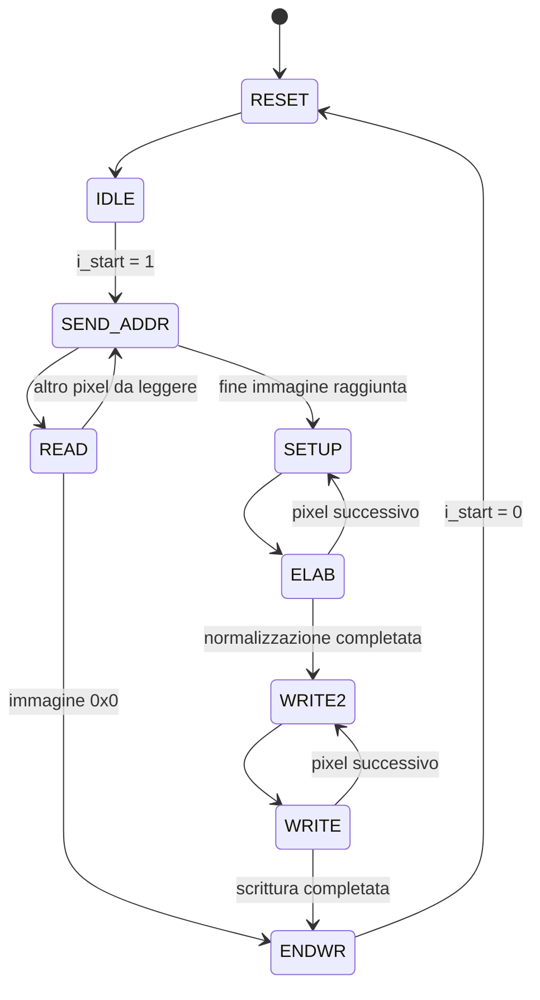

# Image Contrast Stretching — VHDL

[](https://github.com/FynePool/image-contrast-stretching-vhdl/actions/workflows/ci.yml)

Progetto finale del corso di **Reti Logiche** — Politecnico di Milano, A.A. 2020-2021.

Il modulo VHDL implementa in hardware l'algoritmo di **contrast stretching** (normalizzazione min-max) su un'immagine in scala di grigi: legge i pixel da una memoria RAM esterna, individua il valore minimo e massimo, e riscrive ogni pixel riscalato sull'intero range `0-255`.

## Struttura del progetto

```
.
├── src/                         # Modulo finale (project_reti_logiche.vhd)
├── testbench/                   # Testbench di esempio (immagine 2x2), verificato in CI
├── docs/                        # Relazione finale del progetto
├── history/                     # Versioni intermedie del modulo (V0 → V5)
├── tools/
│   ├── generator-python/         # Generatore di test in Python (consigliato)
│   └── generator-c/              # Generatore di test in C (versione precedente)
├── test-results/
│   ├── generator-python/         # Batch di dati di test generati con generator-python
│   └── generator-c/              # Batch di test generati ed eseguiti con generator-c
└── .github/workflows/ci.yml     # Simulazione automatica con GHDL
```

Ogni cartella principale ha un proprio README con i dettagli: [`history/`](history/README.md), [`tools/generator-python/`](tools/generator-python/README.md), [`tools/generator-c/`](tools/generator-c/README.txt), [`test-results/generator-python/`](test-results/generator-python/README.txt), [`test-results/generator-c/`](test-results/generator-c/README.md).

## Il modulo (`project_reti_logiche.vhd`)

Interfaccia richiesta dalla specifica del corso:

| Segnale     | Direzione | Descrizione                          |
|-------------|-----------|---------------------------------------|
| `i_clk`     | in        | Clock                                  |
| `i_rst`     | in        | Reset sincrono                         |
| `i_start`   | in        | Avvio elaborazione                     |
| `i_data`    | in        | Dato letto dalla RAM                   |
| `o_address` | out       | Indirizzo RAM                          |
| `o_en`      | out       | Enable RAM                             |
| `o_we`      | out       | Write enable RAM                       |
| `o_data`    | out       | Dato scritto in RAM                    |
| `o_done`    | out       | Elaborazione completata                |

La RAM contiene, agli indirizzi `0` e `1`, rispettivamente numero di colonne e righe dell'immagine; a partire dall'indirizzo `2` i pixel dell'immagine. Il modulo:

1. Legge dimensioni e pixel, tenendo traccia di min e max (`READ`).
2. Calcola il fattore di shift necessario a normalizzare il range (`SETUP` / `ELAB`).
3. Riscrive ogni pixel normalizzato subito dopo l'immagine originale in RAM (`WRITE2` / `WRITE`).
4. Segnala il completamento con `o_done` (`ENDWR`).

### Diagramma a stati (FSM)



La cartella [`history/`](history/README.md) conserva le versioni intermedie (`V0` → `V5`) che hanno portato alla versione finale.

## Generatore di test

Sono presenti due generatori di test, usati per produrre RAM di input casuali e le rispettive soluzioni attese, da usare nei testbench su Vivado:

- **[`tools/generator-python/`](tools/generator-python/README.md)** (Python 3, consigliato): installazione (`pip install -r requirements.txt`) e uso (`python generator.py --size 1000 --limit 16`).
- **[`tools/generator-c/`](tools/generator-c/README.txt)** (C): generatore precedente, con generazione casuale, da file o da console.

I dati dei batch di test prodotti con entrambi i generatori (RAM di input, soluzioni attese e gli esiti del testbench) sono raccolti nelle cartelle [`test-results/generator-python/`](test-results/generator-python/README.txt) e [`test-results/generator-c/`](test-results/generator-c/README.md).

## CI

Ad ogni push, un workflow GitHub Actions compila `src/project_reti_logiche.vhd` con [GHDL](https://github.com/ghdl/ghdl) ed esegue `testbench/tb_2x2.vhd`, verificando che tutte le assert del testbench risultino passate. Vedi [`.github/workflows/ci.yml`](.github/workflows/ci.yml).

## Come simulare

1. Aprire Vivado e creare un progetto di simulazione.
2. Importare `src/project_reti_logiche.vhd` come sorgente e `testbench/tb_2x2.vhd` (o un testbench generato con `tools/generator-python`) come testbench.
3. Avviare la simulazione behavioral e verificare che i pixel riscritti in RAM corrispondano ai valori attesi.

## Documentazione

- [`docs/report.pdf`](docs/report.pdf) / [`docs/report.docx`](docs/report.docx) — relazione finale del progetto.

La specifica funzionale, le regole di consegna e la FAQ del corso sono materiale didattico del Politecnico di Milano e non sono ridistribuiti in questa repo.

## Licenza

Rilasciato con licenza [MIT](LICENSE).
